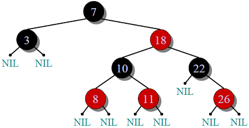
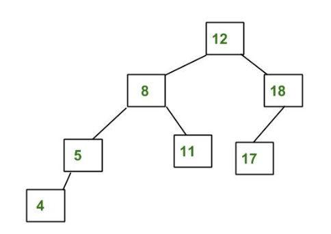

#红黑树和平衡二叉树

[TOC]

## 1 红黑树

- 是什么
- 是一种自平衡二叉查找树，典型用途是用来实现关联数组

    

- 特点
	- 每个节点都有颜色（需要存储颜色信息）
	- 树根节点为黑色
	- 从根节点到叶子节点下方的两个null节点（黑色）的每条路径都有相同数量的黑色节点 
	- 如果一个结点是红的，则它的两个儿子都是黑的
	- 从根到最远的叶的路径的长度不超过从根到最接近的叶的路径的两倍。
- 操作
	- recolor
	- rotation 
- 应用

## 2 平衡二叉树

- 特点
	- 所有左右子树高度差小于2
	- 高度差大于1左右子树重新平衡
	- 严格平衡，检索速度更快
	
## 对比

- 1.平衡二叉树比红黑树查找更快因为平衡限制更严格（一个是不超过1，一个是2倍以内）
- 2.红黑树比二叉平衡树的插入和删除更快速，因为需要旋转的次数更少
- 3.红黑树应用在map，multimap，multiset的C++依赖库中，二叉平衡树则在数据库中应用更多，因为需要迅速的检索
