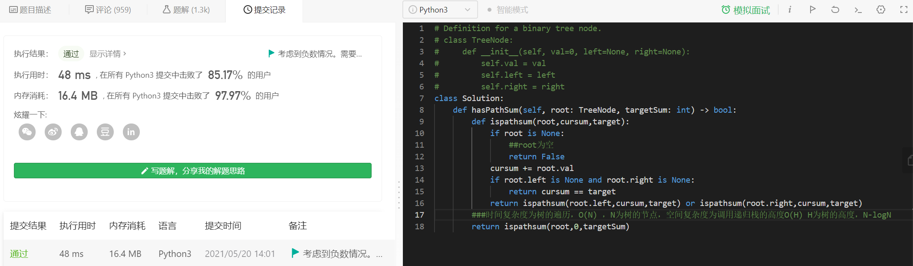

# 每日两道算法题总结

[TOC]


## 0518

###爬楼梯
```python
class Solution:
    def climbStairs(self, n: int) -> int:
        ##类似斐波那契数列
        ##爬到第n层有两种方式，从n-1层爬一级和从n-2层爬两级
        ###fn = fn-1 + fn-2
        ###循环更快
        ###边界条件
        if n < 3:
            return n
        a = 1
        b = 2
        for i in range(3,n+1):
            a,b = b,a+b
        return b
```
###平衡二叉树VS红黑树
## 0519

###83. 删除排序链表中的重复元素（简单）
- 存在一个按升序排列的链表，给你这个链表的头节点 head ，请你删除所有重复的元素，使每个元素 只出现一次 。

```python
# Definition for singly-linked list.
# class ListNode:
#     def __init__(self, val=0, next=None):
#         self.val = val
#         self.next = next
class Solution:
    def deleteDuplicates(self, head: ListNode) -> ListNode:
        #空链表直接返回
        if head is None:
            return head
        pre = head
        cur = head.next
        ##时间O(N) 空间为递归树的高度O（logn）
        while cur is not None:
            nxt = cur.next
            if cur.val == pre.val:
                pre.next = cur.next
                cur.next = None
            else:
                pre = cur
            cur = nxt
        return head

```


### 912使用递归及非递归两种方式实现快速排序(中等)
力扣[912排序](https://leetcode-cn.com/problems/sort-an-array/)

**给你一个整数数组 nums，请你将该数组升序排列。**

 示例 1：

输入：nums = [5,2,3,1]
输出：[1,2,3,5]
示例 2：

输入：nums = [5,1,1,2,0,0]
输出：[0,0,1,1,2,5]

**需要使用快速排序**

**提交代码，两个版本，一个pivot是由第一个元素替代，另一版本中piovt是random生成的，第一版本会报出时间超限**

###递归方法
```python
class Solution:
    def sortArray(self, nums: List[int]) -> List[int]:
        def randomized_partition(self, nums, l, r):
            # pivot = l
            pivot = random.randint(l, r-1)
            ###生成不到r左开右闭
            nums[pivot], nums[r-1] = nums[r-1], nums[pivot]
            i = l 
            for j in range(l, r-1):
                if nums[j] < nums[r-1]:                    
                    nums[j], nums[i] = nums[i], nums[j]
                    i += 1
            nums[i], nums[r-1] = nums[r-1], nums[i]
            return i

        def randomized_quicksort(self, nums, l, r):
            if r - l <= 1:
                return
            mid = randomized_partition(self,nums, l, r)
            # print(mid,nums)
            randomized_quicksort(self,nums, l, mid)
            randomized_quicksort(self,nums, mid + 1, r)

        # 时间复杂度O(nlogn) 空间复杂度O(1)
 
        randomized_quicksort(self,nums,0,len(nums))
        return nums
```


###非递归方法

堆排序


## 0520

###路经总和
给你二叉树的根节点 root 和一个表示目标和的整数 targetSum ，判断该树中是否存在 根节点到叶子节点 的路径，这条路径上所有节点值相加等于目标和 targetSum 。

叶子节点 是指没有子节点的节点。

[力扣](https://leetcode-cn.com/problems/path-sum)

输入：root = [5,4,8,11,null,13,4,7,2,null,null,null,1], targetSum = 22
输出：true


**完成代码**
```python
# Definition for a binary tree node.
# class TreeNode:
#     def __init__(self, val=0, left=None, right=None):
#         self.val = val
#         self.left = left
#         self.right = right
class Solution:
    def hasPathSum(self, root: TreeNode, targetSum: int) -> bool:
        def ispathsum(root,cursum,target):
            if root is None:
                ##root为空
                return False
            cursum += root.val
            if root.left is None and root.right is None:
                return cursum == target
            return ispathsum(root.left,cursum,target) or ispathsum(root.right,cursum,target)
        ###时间复杂度为树的遍历，O(N) N为树的节点，空间复杂度为树的高度O(H)
        return ispathsum(root,0,targetSum)
```
**截图**



### 10亿个数中如何高效地找到最大的一个数以及最大的第K个数

关于大数据量的topK问题，涉及到无法一次性将所有数据读入内存，float在32位处理器占用4个字节，如果是1亿，需要占用400M内存，10亿则需要占用4G内存
- 考虑方法 分治 + hash + 小顶堆

###1.找到最大的一个数
将10亿数据均匀的分成1000份，每份为100 0000个数，每次需要占用4M内存，选出每份中的最大数，将这1000个最大数再进行排序比较

###2.找到最大的K个数
- 通过hash法将这10亿个数字去除重复
- 然后分治，分解成多个小数据集
- 每份数据处理用小顶堆，先取一部分（K）数建堆，和堆顶元素比较，如果比堆顶（最小）元素小，则下一个，如果大，则重新调整小顶堆
- 最后在所有的topK中建堆

- 如果是top词频可以使用分治+ Trie树/hash +小顶堆
- 时间复杂度：O（NlogK）建堆复杂度O（K）

### 3.不同的应用场景的解决方案。
（1）单机+单核+足够大内存

如果有这么大内存，直接在内存中对查询次进行排序，顺序遍历找出出现频率最大的即可。也可以先用HashMap求出每个词出现的频率，然后求出频率最大的10个词。

（2）单机+多核+足够大内存

这时可以直接在内存总使用Hash方法将数据划分成n个partition，每个partition交给一个线程处理，最后一个线程将结果归并。
每个线程的处理速度可能不同，快的线程需要等待慢的线程，最终的处理速度取决于慢的线程。
而针对此问题，解决的方法是，将数据划分成c×n个partition（c>1），每个线程处理完当前partition后主动取下一个partition继续处理，知道所有数据处理完毕，最后由一个线程进行归并。

（3）单机+单核+受限内存

这种情况下，需要将原数据文件切割成一个一个小文件，将原文件中的数据切割成M个小文件，如果小文件仍大于内存大小，继续采用Hash的方法对数据文件进行分割，知道每个小文件小于内存大小，这样每个文件可放到内存中处理。

（4）多机+受限内存

这种情况，为了合理利用多台机器的资源，可将数据分发到多台机器上，每台机器解决本地的数据。可采用hash+socket方法进行数据分发。


##0521

### 215. 数组中的第K个最大元素
[力扣](https://leetcode-cn.com/problems/kth-largest-element-in-an-array/)
在未排序的数组中找到第 k 个最大的元素。请注意，你需要找的是数组排序后的第 k 个最大的元素，而不是第 k 个不同的元素。

示例 1:

输入: [3,2,1,5,6,4] 和 k = 2
输出: 5
示例 2:

输入: [3,2,3,1,2,4,5,5,6] 和 k = 4
输出: 4


```python
class Solution:
    def findKthLargest(self, nums: List[int], k: int) -> int:
        ##方法一
        ##排序后求第k个元素
        # nums.sort(reverse=True)
        # return nums[k-1]
        ##时间复杂度 ，快排时间复杂度 O(nlogn) 空间复杂度O（H）

        ##方法二 改进快排，进行划分
        # 手动构造长度为K的小顶堆
        # 堆顶元素最小
        # 如果发现比它大的，则入堆，调整后堆顶仍是当前的第K大的数
        hp=[None]+nums[:k]
        
        def hpsort(hp, i):
            #从上到下整理堆
            lc=2*i
            rc=lc+1
            newi=i
            if lc<len(hp) and hp[lc]<hp[newi]:
                newi=lc
            if rc<len(hp) and hp[rc]<hp[newi]:
                newi=rc
            if newi!=i:
                hp[newi], hp[i]=hp[i], hp[newi]
                hpsort(hp, newi)
        def hpbuild(hp):
            import math
            for i in range(math.floor((len(hp)/2)), 0, -1):
                hpsort(hp, i)
        
        hpbuild(hp)
        for i in range(k, len(nums)):
            if nums[i]>hp[1]:
                hp[1]=nums[i]
                hpsort(hp,1)
        return hp[1]
```


###141.环形链表
[leetcode](https://leetcode-cn.com/problems/linked-list-cycle/)
给定一个链表，判断链表中是否有环。

如果链表中有某个节点，可以通过连续跟踪 next 指针再次到达，则链表中存在环。 为了表示给定链表中的环，我们使用整数 pos 来表示链表尾连接到链表中的位置（索引从 0 开始）。 如果 pos 是 -1，则在该链表中没有环。注意：pos 不作为参数进行传递，仅仅是为了标识链表的实际情况。

如果链表中存在环，则返回 true 。 否则，返回 false 

```python
# Definition for singly-linked list.
# class ListNode:
#     def __init__(self, x):
#         self.val = x
#         self.next = None

class Solution:
    def hasCycle(self, head: ListNode) -> bool:
        #链表中某个位置不能两次到达       
        #尝试用字典
        #时间复杂度O(N) 空间复杂度O(N)
        # dic = dict()
        # while head is not None:
        #     if head in dic:
        #         return True
        #     else:
        #         dic[head] = 1
        #     head = head.next
        # else:
        #     return False

        ##空间复杂度为O(1)的解法
        ##快慢指针
        # 确定两个指针初始值
        # 假设存在虚拟头节点，使得，慢指针在head 快指针在head->next
        if head is None:
            return False
        slow = head
        quick = head.next
        while slow is not quick :
            if quick is None or quick.next is None:
                return False
            slow = slow.next
            quick = quick.next.next 
        return True

```


## 0524


### 如何通过一个不均匀的硬币得到公平的结果

问题描述：有一枚不均匀的硬币，抛出此硬币后，可用foo()表示其结果。已知foo()能返回0和1两个值，其概率分别为0.6和0.4。问怎么利用foo()得到另一个函数，使得返回0和1的概率均为0.5。


(1) 两次均为正面：0.6*0.6=0.36

(2)第一次正面，第二次反面：0.6*0.4=0.24

(3)第一次反面，第二次正面：0.4*0.6=0.24

(4)两次均为反面：0.4*0.4=0.16

用 coin()表示能产生不同概率的函数（即硬币）
设计算法
```python
def makecoin(){
    while True:
        a = coin() # 可能是正面或反面
        if a != coin():
            return a
}
```

### 232. 用栈实现队列
请你仅使用两个栈实现先入先出队列。队列应当支持一般队列支持的所有操作（push、pop、peek、empty）：

实现 MyQueue 类：

void push(int x) 将元素 x 推到队列的末尾
int pop() 从队列的开头移除并返回元素
int peek() 返回队列开头的元素
boolean empty() 如果队列为空，返回 true ；否则，返回 false


说明：

你只能使用标准的栈操作 —— 也就是只有 push to top, peek/pop from top, size, 和 is empty 操作是合法的。
你所使用的语言也许不支持栈。你可以使用 list 或者 deque（双端队列）来模拟一个栈，只要是标准的栈操作即可。

来源：[LeetCode](https://leetcode-cn.com/problems/implement-queue-using-stacks)

- 实现
```python
class MyQueue:

    def __init__(self):
        """
        Initialize your data structure here.
        """
        self.lista = []
        self.listb = []

    def push(self, x: int) -> None:
        """
        Push element x to the back of queue.
        """
        self.lista.append(x)
        
    def pop(self) -> int:
        """
        Removes the element from in front of queue and returns that element.
        """
        while len(self.lista) != 0:
            self.listb.append(self.lista.pop())
        cur = self.listb.pop()
        while len(self.listb) != 0:
            self.lista.append(self.listb.pop())
        return cur

    def peek(self) -> int:
        """
        Get the front element.
        """
        while len(self.lista) != 0:
            self.listb.append(self.lista.pop())
        cur = self.listb.pop()
        self.lista.append(cur)
        while len(self.listb) != 0:
            self.lista.append(self.listb.pop())
        return cur

    def empty(self) -> bool:
        """
        Returns whether the queue is empty.
        """
        if len(self.lista) == 0 and len(self.listb) == 0:
            return True
        else:
            return False

```

