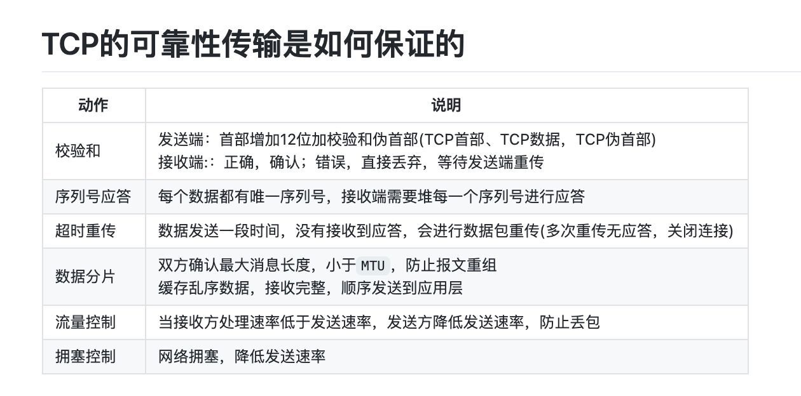
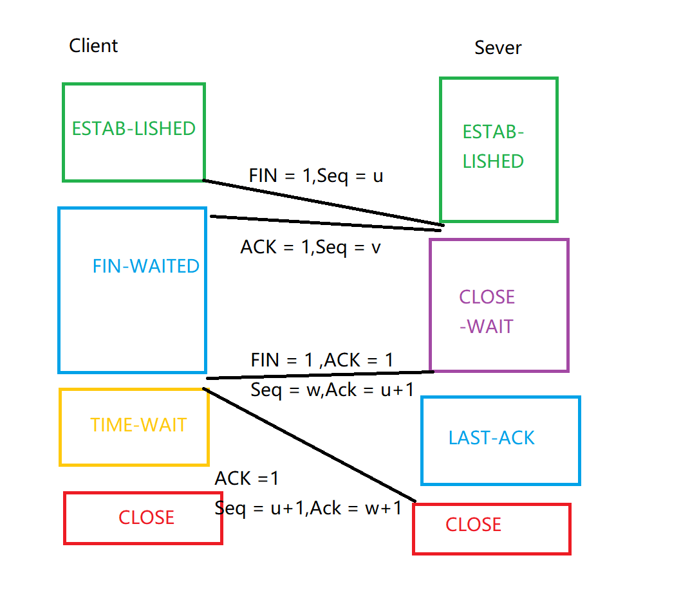

计算机网络知识总结

[TOC]
# TCP相关

## 1 简述 TCP 三次握手以及四次挥手的流程。为什么需要三次握手以及四次挥手

- TCP协议是什么，位于哪一层
	- Transmission Control Protocol，传输控制协议，是一种面向连接的、可靠的、基于字节流的传输层通信协议
	- TCP协议位于OSI七层架构中第四层传输层，TCP/IP结构中第三层 

    

	- 其中网络层用来提供主机之间的逻辑通信，但不能确保可靠性，传输层在主机间的逻辑通信上，提供进程之间逻辑通信，TCP协议在不可靠的网络层协议上构建出可靠的，拥有拥塞机制的交付服务。
	
- 三次握手指的是什么，为什么要进行三次握手
	- 三次握手指的是TCP连接的建立需要服务器和客户端总共发送三个包
	- 在三次握手之后，双方确认了对方的起始序列号和窗口大小等
	- 只有经过三次握手才能确保服务器端客户端的收发功能都正常
	
- 四次挥手
	- TCP连接的拆除，当连接的一方想要关闭连接时，就会向对方发送FIN标识，对方回复一个确认包。过了一会，另一方也准备断开连接，发送FIN。接收方接收到回复确认包并等待一段时间在关闭连接。 
	- 确保连接终止，不会出现多余的FIN标识在下一个包内
	
- 怎么进行操作
	
	- SYN标识表示该包请求建立连接
	- 客户端向服务器发送SYN = 1建立连接，并告诉服务器想要连接的端口号
	- 服务器发送SYN = 1 建立与客户端连接，发送ACK确认应答，并将自己的ISN号放在seq域中，将客户端的seq+1 放在ACKnum
	- 客户端向服务器发送ACK包，将ACKnum置为服务器的ISN（initial sequence number）号+1

	
	- 通过close()指令
	- FIN标识表示该包请求断开连接
	- 客户端向服务器发送 FIN = 1 seq = x ,表示自己已经没有数据需要传输，但还可以接收数据，请求断开连接
	- 服务器向客户端发送一个确认包 ACK= 1 ，ACKnum = x+1表示收到客户端请求，但还没有准备好关闭连接
	- 服务器向客户端发送 FIN =1 seq = y 表示服务器可以断开连接了，等待客户端指示
客户端向服务器发送确认包，ACK = 1 ACKnum = y+1，服务器收到后关闭连接，客户端等待一段时间后（两个生命周期）后自动关闭连接

## 2 TCP 怎么保证可靠传输？

TCP 通过序列号，检验和，确认应答，重发控制，连接管理，窗口控制，流量控制，拥塞控制实现可靠性

总结


- 是什么
- 为什么要提供可靠传输
- 怎样实现

TCP报文头部


**校验和**
- TCP将保持它首部和数据的检验和。检测数据在传输过程中的变化，如果检验和有差错，将丢弃报文不确认收到

**停止等待协议**
- 原理：发完一个分组停止发送等待确认，若接收方接收到重复分组，则丢弃该分组同时也要回复确认

- 每发送完一个分组设置一个超时计时器，重传时间比数据往返时间长一点。自动重传请求ARQ（优点，简单，缺点，信道利用率低）
- 如果确认迟到则发送方收到这个确认什么都不做，由接收方丢弃重复的分组。
	**连续ARQ协议** 
	- 位于发送窗口的分组可以连续发送而无需等待确认。接收方采取累计确认，对按序到达的最后一个分组发送确认，表明到这个分组为止所有的分组都已经正确收到
	- 优点：信道利用率高  缺点： 不能反应正确接收到所有分组的信息

**滑动窗口和流量控制**
- 滑动窗口是一种流量控制技术，TCP中采用滑动窗口来进行传输控制。滑动窗口的大小意味着接收方还有多大的缓存区用来接受数据，当滑动窗口大小为0时，发送方不能在发送数据。（两种情况除外，一个是紧急数据，比如终端连接，另一种是发送1字节数据通知接收方声明希望接受的下一字节以及滑动窗口的大小）
- 接收方发送的报文段中的窗口字段可以控制发送方的滑动窗口大小

**拥塞控制**

- 如何产生拥塞
	- 某一时间段，对网络中某一资源的需求超过了该资源提供的可用部分 
- 如何拥塞控制
	- 慢开始，拥塞避免，快重传和快恢复 
	- **慢开始** 主机开始发送数据时由小到大（1，2，4，8）增加发送窗口，cwnd初始值为1，经过一个传播轮次加倍。
	
	- **快重传和恢复**（Fast Retransmit and Recovery, FRR）如果收到不按顺序的数据，接受方会立即给发送方一个重复确认。当发送方收到三个相同的重复确认，会迅速重传丢失的数据段。不会因为重传时要求的暂停被耽误。
	


## 3.TCP 与 UDP 在网络协议中的哪一层，他们之间有什么区别？

### (1) OSI/TCP 概念模型各层作用和协议
| OSI七层网络协议     |  TCP/IP四层概念模型      | 每层作用         |    对应网络协议    |
|  -    |  -      |     -     |  -      |
|  应用层 Applicatidon    |        |   定义了应用进程之间的交互规则，交互数据单元为报文       |  DNS,HTTP,SMTP（电子邮件）      |
| 表示层  Presentation     |   应用层     | 使通信的应用程序能够解释交换数据的含义，提供服务：数据压缩，数据加密，数据描述         | TIFF,GIF,JPEG       |
| 会话层  Session     |       |  会话层就是负责建立、管理和终止表示层实体之间的通信会话。该层提供了数据交换的定界和同步功能        | RPC,SQL       |
| 传输层   Transpot     |   传输层     |  为两台主机进程之间的通信提供服务        |  TCP ,UDP      |
| 网络层   Network     |    网络层    | 选择合适的网间路由和交换节点，确保数据按时成功传送，把传输层产生的报文或用户数据报封装成分组和包向下传送到数据链路层         | IP,ICMP,ARP,  RARP     |
| 数据链路层   Data Link     |       |  将网络层传输下来的 IP数据报组装成帧，在两个相邻结点的链路上传送帧        | FDDI, Frame Relay, HDLC, SLIP, PPP       |
| 物理层   Physical      |    数据链路层    |   实现计算机节点之间比特流的透明传送       | EIA/TIA-232, EIA/TIA-499, V.35, 802.3       |

- **TCP和UDP位于OSI模型的传输层，TCP/IP模型的传输层**

### (2)  UDP 和 TCP 协议区别

| 类型        |   是否面向连接    | 传输可靠性    |  传输形式     |   传输效率   |   所需资源  |应用场景   | 首部字节 |
|   -      |   -    |  -   |     -  |      -|  -   | -   | -  |
|  TCP       |   是    |  可靠（校验和，超时重传，序号应答）   |       字节流| 慢   |   多    | 文件传输，邮件传输   |  20字节 |
|  UDP       |  否    |  不可靠   |   报文段    |  快    | 少    | 即时通讯，域名转换   | 8字节  |


##4.TCP的CLOSE-WAIT 和 TIME-WAIT 


###CLOSE-WAIT
在服务器收到客户端关闭连接的请求并告诉客户端自己已经成功收到了该请求，服务器进入了CLOSE-WAIT状态，服务器端此时可能有一些数据没有传输完成，因此不能立即关闭连接

###TIME-WAIT
发生在第四次挥手，当客户端向服务器发送ACK确认报文，若取消该状态，即客户端在收到服务端的 FIN 报文后立即关闭连接，此时服务端相应的端口并没有关闭，若客户端在相同的端口立即建立新的连接，则有可能接收到上一次连接中残留的数据包，可能会导致不可预料的异常出现。除此之外，假设客户端最后一次发送的 ACK 包在传输的时候丢失了，由于 TCP 协议的超时重传机制，服务端将重发 FIN 报文，若客户端并没有维持 TIME-WAIT 状态而直接关闭的话，当收到服务端重新发送的 FIN 包时，客户端就会用 RST 包来响应服务端，这将会使得对方认为是有错误发生，然而其实只是正常的关闭连接过程，并没有出现异常情况。


##  5.Cookie 和 Session 的关系和区别是什么


- Session和Cookie 都是用来跟踪浏览器用户身份的会话方式

### (1) Session工作原理

- 1.浏览器发送请求到服务器端，服务器创建一个Session，同时创建一个特殊的Cookie,将该Cookie的发送至浏览器端
- 2.浏览器端发送第N次请求到服务器端，浏览器端访问服务器端时就会携带该Cookie对象
- 3.服务器端根据服务器端根据name为JSESSIONID的Cookie的value(sessionId),去查询Session对象，从而区分不同用户。
	- 1.name为JSESSIONID的Cookie不存在（关闭或更换浏览器），返回1中重新去创建Session与特殊的Cookie
	- 2.name为JSESSIONID的Cookie存在，根据value中的SessionId去寻找session对象
	- 3.value为SessionId不存在**（Session对象默认存活30分钟）**，返回1中重新去创建Session与特殊的Cookie。value为SessionId存在，返回session对象


### (2)Cookie工作原理

- 1.浏览器发送请求到服务器端
- 2.服务器端创建Cookie，该Cookie中包含用户信息，然后将该Cookie发送到浏览器端
- 3.浏览器端再次访问服务器端时会携带服务器端创建的Cookie
- 4.服务器端通过Cookie中携带的数据区分不同的用户

### (3)对比
|        |    数据保存 |  安全性      |   过期时间   |  占用服务器性能   |应用场景|
| -|-|-|-|-|-|
| Session   | 服务器端   | 高，不容易被攻击   |更换或关闭浏览器，取决于服务器设定   | 多  |登陆验证信息|
| Cookie   |浏览器端    | 低，容易被攻击   | 可以设置有效值，可长期有效   | 少  |判断用户是否登陆过网站，购物车类的处理和设计|


# RestFul 相关总结

##1.RestFul 是什么？RestFul 请求的 URL 有什么特点

**REST**
Representational State Transfer
用来表示客户端通过某种形式获取服务器端的数据，这些数据通常是JSON或者XML。可以理解为：在设计API时，使用路径定位资源，方法定义操作，通过Cotent-Type和Accept协商资源类型
- **资源的定义**
	- 资源是什么：任何事物只要有被引用到的必要，就可以称之为资源，列如，某人的手机号，个人信息，两个产品的关系
	- URI（Uniform Resource Identifier)表示一个资源的唯一标识（可寻址）
- **Representation** 表现层：把资源具体呈现出来的形式，例如，文本可用txt,json,html格式表现。
-  **状态转换(State Transfer)**
	- 每发出一个请求，就代表了客户端和服务器的一次交互。HTTP协议是无状态协议，所有的状态都保存在服务器端。因此，客户端想要操作服务器，必须通过某种手段让服务器发生状态转移(State Transfer)。就是HTTP协议里面，四个表示操作方式的动词：GET、POST、PUT、DELETE。他们分别对应四种基本操作：GET用来获取资源，POST用来新建资源，PUT用来更新资源，DELETE用来删除资源。
		- GET
		- PUT
		- POST
		- DELETE

**限制**
- REST是无状态的，请求之间没有持久的会话信息
- 响应需要声明成可缓存的
- REST关注一致性，如果使用HTTP，需要尽可能使用HTTP的特性，而不是去发明新的公约

##2.RestFul 与 RPC 的区别是什么？RestFul 的优点在哪里？

###RPC
RPC代表远程过程调用（romote procedure call），RPC是跨语言跨平台的服务调用。在实际应用中，前端传递方法名和参数给后端，后端执行对应方法，并将最后执行结果返回给前端。
- 1.REST使用HTTP的方法，例如：GET,POST,PUT,DELETE,OPTIONS还有比较不常用的PATCH方法。
- 2.RPC通常只会使用GET和POST方法，GET方法通常用来获取信息，POST方法可以用来进行所有的行为。
- 3.RPC：发送一个消息，然后消息会存储到数据库中来保存历史，有可能会有其他的RPC调用，但这个操作对我们不可见
- 4.REST：在用户的消息集合中创建一条消息资源，我们能够通过GET方法来通过相同的URL获取这个历史

**RPC  &&  ReatFul**
当发送一条消息给用户
RPC
```
POST /SendUserMessage HTTP/1.1
Host: api.example.com
Content-Type: application/json

{"userId": 501, "message": "Hello!"}
```

REST
```
POST /users/501/messages HTTP/1.1
Host: api.example.com
Content-Type: application/json

{"message": "Hello!"}

```

# HTTP 相关

## 1.简述 HTTP 1.0，1.1，2.0 的主要区别

|   |HTTP 1.0  |HTTP 1.1 |HTTP 2|
|-|-|-|-|
|缓存处理字段 |if-modified-Since, Expries | 增加Entity-tag, If-Unmodified-Since, If-Match, If-None-Match    |   |
| 并发性 | 客户端请求资源时将资源相关的整个对象传给请求方|请求头中引入range头域，允许只请求部分资源|   |
|  状态响应码 |    |新增24个错误状态响应码，410表示所请求资源被永久删除|
|  host请求头 | 无   |请求和响应消息应声明该字段，否则会生成404状态码|
|长连接|短暂连接 每次请求都重新建立一个TCP连接|默认持久连接，支持一个TCP请求中传送多个HTTP请求和响应|    |
|数据传送格式|  文本传送|文本传送|二进制传送|
|是否支持多路复用|  否|否|支持，同一个HTTP请求可以实现多个HTTP请求传输，可以通过流ID定位HTTP请求|
|支持服务器推送|  否|否|是|
|头部压缩|  -|-|通信双方会维护一张头信息表，所有字段都记录在这张表中，在每次 HTTP 传输时只需要传头字段在表中的索引即可|


## 2.简述常见的 HTTP 状态码的含义


| 状态码    |  说明  |
|-|-|
|  200   | 响应成功   |
|  404   | 请求资源不存在   |
|   302  | 正在跳转   |
|  403   | 认证失败，客户端收到请求但拒绝执行   |
|  500   |  服务器内部错误  |


## 3.HTTP 中 GET 和 POST 区别

- 安全性：get 提交的数据会放在URL后，并且请求参数会被完整的保留在浏览器的记录里，因为参数直接暴露在URL中可能存在安全问题，因此常常用来获取资源信息。post参数放在请求主体中，并且参数不会被保留有。
- 支持编码： get 只支持URL编码，而post请求支持多种编码格式
- 参数支持：get 只支持ASCII格式的字符参数，post无限制
- get 提交数据大小有限制（针对浏览器而言），而post没有限制
- get 需要使用 Request.QueryString 来取得变量的值，而post方式通过Request.Form来获取
- get 方法产生一个TCP数据包，post方法产生两个（并不是所有浏览器都产生两个）

## 4.HTTP 与HTTPS的工作方式

###HTTP

HTTP(Hyper Text Transfer Protocol)超文本传输协议，是一种简单的请求-响应协议，被用于在Web浏览器和网站服务器之间传递消息。HTTP使用TCP作为支撑运输层协议。默认端口为80.HTTP客户机发起一个与服务器的TCP连接，一旦连接建立，浏览器和服务器进程就可以通过套接字接口访问TCP。客户机从套接字接口发送HTTP请求报文和接收HTTP响应报文。其通信内容以明文的方式发送，不通过任何方式的数据加密。通信结束时关闭连接。

### HTTPS

HTTPS(Hyper Text Transfer Protocol Secure Socket Layer)是以安全为目标的HTTP协议，在HTTP的基础上通过**传输加密**和**身份认证**的方式保证了传输过程的安全性。
- 客户端发起HTTPS请求，连接服务器的443端口，发送信息包括自身支持的算法和密钥长度。
- 服务器将自身支持的加密算法与客户端的列表对比并选择一种支持的加密算法，将其和其他密钥组件一同发送给客户端。
- 服务器向客户端发送一个包含数字证书的报文，该数字证书中包含证书的颁发机构，过期时间，服务端的公钥等信息。
- 最后服务端发送一个报文通知客户端SSL的第一阶段已经协商完成
-  SSL 第一次协商完成后，客户端发送一个回应报文，报文中包含一个客户端生成的随机密码串，称为 pre_master_secre，并且该报文是经过证书中的公钥加密过的。
-  紧接着客户端会发送一个报文提示服务端在此之后的报文是采用pre_master_secre 加密的。
-  客户端向服务端发送一个 finish 报文，这次握手中包含第一次握手至今所有报文的整体校验值，最终协商是否完成取决于服务端能否成功解密。
- 服务端同样发送相同作用的报文，已让客户端进行确认，最后发送 finish 报文告诉客户端自己能够正确解密报文。

当服务端和客户端的 finish 报文交换完成之后，SSL 连接就算建立完成了，之后就进行和 HTTP 相同的通信过程，唯一不同的是在 HTTP 通信过程中并不是采用明文传输，而是采用对称加密的方式，其中对称密钥已经在 SSL 的建立过程中协商好了。

### HTTP 和 HTTPS 的区别
|     | HTTP   |  HTTPS   |
|  -   |  -  |  -   |
| 安全性    |  协议以明文发送，数据都是未加密的，安全性较差  | HTTPS数据传输过程是加密的，安全性较好    |
|  连接方式   |  使用80端口  |  使用443端口   |
| 页面响应    | 较快，使用三次握手建立连接   |  除了TCP三次握手，要先建立SSL连接   |