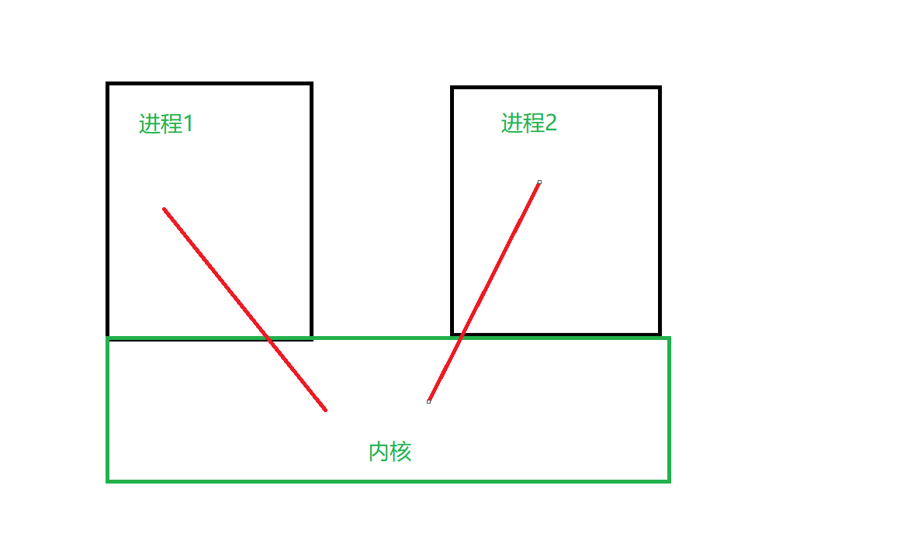
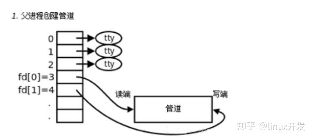
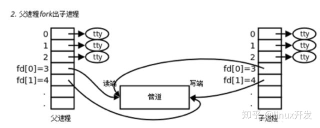
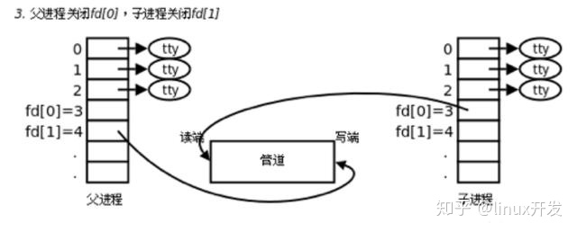
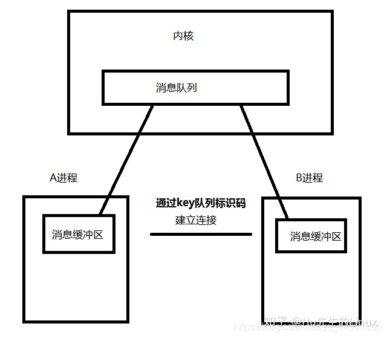

# 进程和线程

[TOC]

## 1 进程和线程的区别

- **进程**
	- 进程是程序一次的执行过程	
	- 进程是程序在执行过程中分配和管理资源的基本单位。
	- 进程有自己的地址空间
	- 进程有五种状态：初始，执行，等待，就绪，终止

- **线程**
	- 线程是CPU调度和分派的基本单位，可与同属一个进程的其他线程共享资源
- **进程与线程**
	- 包含关系：线程是进程的一部分，一个线程只属于一个进程，一个进程可以有多个线程
	- 进程是操作系统分配资源的基本单位，而线程是任务调度和执行的基本单位
	- 内存分配：系统为每个进程分配内存空间，系统不为线程分配空间，线程组共享资源 

## 2 进程间通信

- **进程通信**
	- 进程间通信是指在进程间传输数据，进程通信根据交换信息量的多少和效率高低，分为低级通信（只能传递状态和整数值）和高级通信（提高信号通信效率，传递大量数据）

- **为什么进程间需要通信**
	- 1.数据传输   一个进程将数据发送给另一个进程
	- 2.资源共享  多个进程之间需要共享同样的资源
	- 3.通知事件  一个进程需要向另一个或一组进程发送消息，通知它们发生了某种事件
	- 4.进程控制 有些进程希望完全控制另一个进程的执行（例如debug）

- **进程通信的原理**
	- 每个进程都有自己独立的内存空间，进程之间进行数据交换需要在内核开辟一块缓冲区，进程1把数据拷到缓冲区，进程2再从缓冲区读取数据
    

- **进程间通信的几种方式**
	- 管道通信，由pipe函数创建
		- 有一个读端，一个写端，通过read或write向这个管道（内核缓冲区）读写数据
	
	
	
		- 使用管道通信的缺点（只能实现单向通信，如果想实现双向通信需要再创建一个管道；只能用于具有亲缘关系的进程，例如父子兄弟）
	- 命名管道（解决了管道只能用于具有亲缘关系的进程通信的不足，命名管道是一个存在于硬盘中的文件）
	- 消息队列（msg）
		- 传递的是某种数据结构而不是字节流，内核基于链表
		- 向消息队列中写数据时插入一个节点，读消息是删除一个节点
		- 每个数据块的最大长度有上限，系统上全体队列的长度也有上限
		
		
		- 无论发送还是接受数据，都需要在进程中用消息缓冲区来暂存消息
	- 信号量（sem）
		- 本质上是一个锁，用来管理临界资源

