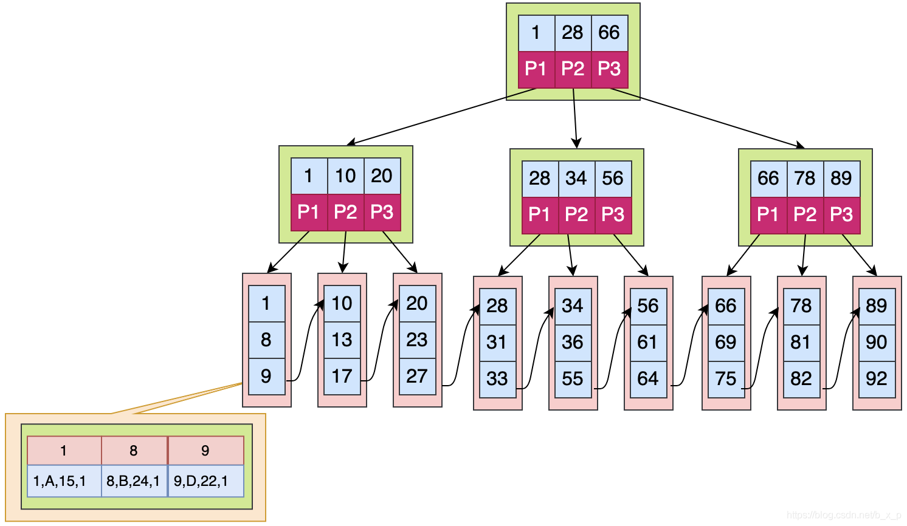

# MQSQL相关

[TOC]

## MySQL 为什么使用 B+ 树来作索引，对比 B 树它的优点和缺点是什么？

###B树和B+树

#### B树 （Balance Tree 多路平衡查找树）

**属性**
- B树是一种多路平衡查找树
- 每个节点存储n个关键字，有n+1路
**特点**
- 每个节点最多有n个孩子，除了根节点和叶子节点外，其他每个节点至少有m/2个孩子
- 若根节点不是叶子节点，则至少有两个孩子
- 所有叶子节点都在同一层

#### B+树

**属性**
- 非叶子节点只存储键值信息
- 数据检索规则为左开右闭
- 所有叶子节点之间有链指针
- 数据记录都放在叶子节点中

**B-tree和B+ Tree区别**
- 关键字的搜索，B树命中后就不会继续往下查找，因此每次找到关键字读取硬盘的次数不固定，B+树是左开右闭，所有结果均存在叶子节点中
- B+树根节点和枝节点没有数据，只有多路指针，数据保存在叶子节点中
- B+树叶子节点间存在链指针而B树没有
- B+树叶子节点不保存子节点的引用
###MySQL索引是什么
- 索引是一个单独的，存储在磁盘上的数据结构，包含着对数据表里所有记录的引用指针
- 索引用于快速找出某个列或多个列中一行特定的值
- 所有列都可以被索引
###MySQL为什么使用B+ 树来作索引
**磁盘预读**
MySQL通常将数据存放在磁盘中，读取数据就会产生磁盘IO消耗。而B+树的非叶子节点中不保存数据，B树非叶子节点会保存数据。B+树非叶子节点不用保存数据因此可以放更多的key，所以B+树高度比B树小，磁盘消耗更低
**全表遍历**
B+树叶子节点构成链表，更利于范围查找和排序，而B树范围查找需要遍历树。
且B+树查询次数一致，单次查询时间较稳定。
**为什么不用红黑树**
红黑树会使高度增高，增加IO消耗

##乐观锁悲观锁的原理和使用场景
乐观锁和悲观锁是两种思想，用于解决并发场景下的数据竞争问题
###原理
**乐观锁和悲观锁对比**
|   术语   |   描述   |    示例  |
| ---- | ---- | ---- |
|  乐观锁    |   取数据时认为别人不会修改，但是更新数据时会判断一下在此期间是否有人修改数据   |  版本号或时间戳控制，适用于多读少写的场景    |
| 悲观锁     | 每次操作数据都会上锁，操作期间其他进程无法访问     |   DB行锁，表锁，适用于数据一致性较高的场景   |

**乐观锁**
先进行业务操作，在最后一步修改数据时再加锁
**悲观锁**
操作数据时就把数据锁住，操作完成后释放锁
###使用场景
乐观锁：
- 高并发，多读少写的场景
悲观锁：
- 并发量不大并且出现并发情况可能导致严重异常的情况下。

