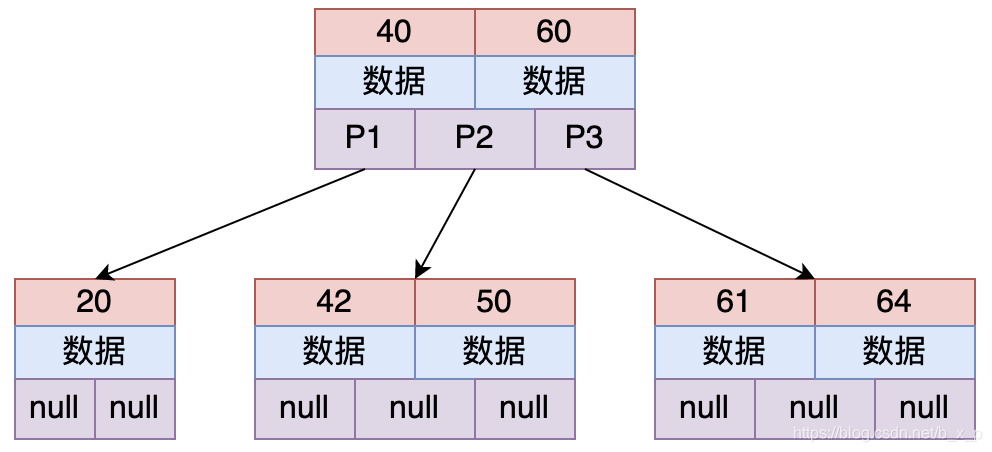
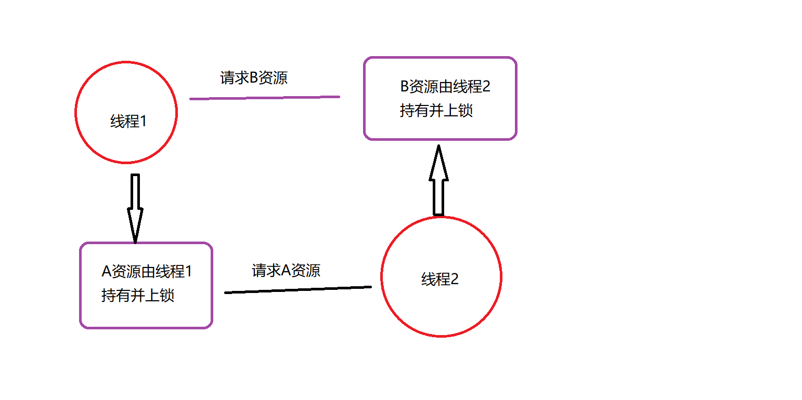

# MQSQL相关

[TOC]

## MySQL 为什么使用 B+ 树来作索引，对比 B 树它的优点和缺点是什么？

###B树和B+树

#### B树 （Balance Tree 多路平衡查找树）

**属性**
- B树是一种多路平衡查找树
- 每个节点存储n个关键字，有n+1路
**特点**
- 每个节点最多有n个孩子，除了根节点和叶子节点外，其他每个节点至少有m/2个孩子
- 若根节点不是叶子节点，则至少有两个孩子
- 所有叶子节点都在同一层

#### B+树

**属性**
- 非叶子节点只存储键值信息
- 数据检索规则为左开右闭
- 所有叶子节点之间有链指针
- 数据记录都放在叶子节点中

**B-tree和B+ Tree区别**
- 关键字的搜索，B树命中后就不会继续往下查找，因此每次找到关键字读取硬盘的次数不固定，B+树是左开右闭，所有结果均存在叶子节点中
- B+树根节点和枝节点没有数据，只有多路指针，数据保存在叶子节点中
- B+树叶子节点间存在链指针而B树没有
- B+树叶子节点不保存子节点的引用
###MySQL索引是什么
- 索引是一个单独的，存储在磁盘上的数据结构，包含着对数据表里所有记录的引用指针
- 索引用于快速找出某个列或多个列中一行特定的值
- 所有列都可以被索引
###MySQL为什么使用B+ 树来作索引
**磁盘预读**
MySQL通常将数据存放在磁盘中，读取数据就会产生磁盘IO消耗。而B+树的非叶子节点中不保存数据，B树非叶子节点会保存数据。B+树非叶子节点不用保存数据因此可以放更多的key，所以B+树高度比B树小，磁盘消耗更低
**全表遍历**
B+树叶子节点构成链表，更利于范围查找和排序，而B树范围查找需要遍历树。
且B+树查询次数一致，单次查询时间较稳定。
**为什么不用红黑树**
红黑树会使高度增高，增加IO消耗

##乐观锁悲观锁的原理和使用场景
乐观锁和悲观锁是两种思想，用于解决并发场景下的数据竞争问题
###原理
**乐观锁和悲观锁对比**
|   术语   |   描述   |    示例  |
| ---- | ---- | ---- |
|  乐观锁    |   取数据时认为别人不会修改，但是更新数据时会判断一下在此期间是否有人修改数据   |  版本号或时间戳控制，适用于多读少写的场景    |
| 悲观锁     | 每次操作数据都会上锁，操作期间其他进程无法访问     |   DB行锁，表锁，适用于数据一致性较高的场景   |

**乐观锁**
先进行业务操作，在最后一步修改数据时再加锁
**悲观锁**
操作数据时就把数据锁住，操作完成后释放锁
###使用场景
乐观锁：
- 高并发，多读少写的场景
悲观锁：
- 并发量不大并且出现并发情况可能导致严重异常的情况下。

## 数据库的事务隔离级别有哪些，各有什么优缺点

###什么是数据库事务，数据库事务的性质（ACID）
- 数据库事务：是访问并可能操作各种数据项的一个数据库操作序列，是一个不可分割的工作单位。数据库事务由事务开始和事务结束中间所有的数据库操作组成。这些操作要么全部执行，要么全部不执行。
- 事务的性质（ACID）
	- 原子性 Atomicity 事务不可分割，要么全部执行，要么全部不执行
	- 一致性 Consistency 几个并行执行的事务其执行结果必须与按某一顺序串执行结果相一致。以银行转账事务事务为例。在事务开始之前，所有账户余额的总额处于一致状态。在事务进行的过程中，一个账户余额减少了，而另一个账户余额尚未修改。因此，所有账户余额的总额处于不一致状态。事务完成以后，账户余额的总额再次恢复到一致状态。
	- 隔离性 Isolation 对数据修改的所有并发事务都是隔离的，不应该以任何方式依赖或影响其他事务
	- 持久性  Durability 不管系统是否发生故障，只要事务处理完成，对数据库所做的改变就是永久的。
###数据库的隔离级别应用和优缺点
- 数据库的四种隔离级别
	- Read Uncommitted 读未提交 ：级别最低，任何事情都可能发生
		- 表示还没有提交的操作被读取到
	- Read Committed 读已提交：避免脏读发生
		- 另一事务改变了数据库信息并且已经成功提交
	- Repeatable Read：避免脏读，不可重复读发生（MYSQL默认隔离级别）
		- 一旦事务开始，其他事务不能对该记录进行修改 
		- 但其他事务可以新增记录insert，会出现幻读
	- Serializable ：避免脏读，不可重复读，幻读发生
		- 代价花费最高性能很低 

- 数据库的四种隔离级别优缺点
	- 读未提交是级别最低的隔离，仅保证不读取物理损坏的数据
	- 读已提交保证一个并行事务不会读到另一个事务未提交的修改，避免了脏读。
	- 可重复读，保证了在任何情况下，同一个事务中前后数次所读取的数据都是一致的

##什么情况下会发生死锁，如何解决死锁

###死锁是什么，如何产生

当多个进程访问同一个数据库，其中每个进程拥有的锁都是其他进程所需的，比如A进程执行完成需要等B释放资源，B又等A释放资源，就互相形成死锁。
**MySQL有三种锁的级别：页级、表级、行级。**
- 一般出现死锁都是行级锁
**死锁产生的必要条件**
	- 1.互斥：资源互斥使用
	- 2.请求与保持：多个进程保持一定资源又请求新的资源
	- 3.不剥夺：资源不可被剥夺
	- 4.循环等待：多个进程循环等待
数据库产生死锁：**当表进行了分区并且ALTERTABLE的LOCK_ESCALATION设置设为AUTO时也会发生死锁**

###如何解决死锁问题
- 破坏请求和保持条件
	- 一次性申请全部资源，用完释放
	- 只申请初期运行资源，运行完释放资源再申请下一部分资源
- 破坏不剥夺条件
	- 若一个进程获得不可抢占资源，则再申请新资源时如果失败，则释放所有资源 。之后需要的话再次申请
- 破坏循环等待条件
	- 对资源进行排号，按照序号递增的条件申请资源 

