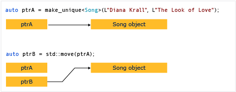

### C++
- C++ 中智能指针和指针的区别是什么？
- C++ 中多态是怎么实现的

### 网络
- 从输入 URL 到展现页面的全过程
- 简述 TCP 三次握手以及四次挥手的流程。为什么需要三次握手以及四次挥手
- HTTP 与 HTTPS 有哪些区别
- RestFul 是什么？RestFul 请求的 URL 有什么特点

### 数据库
- MySQL 为什么使用 B+ 树来作索引，对比 B 树它的优点和缺点是什么
- Redis 如何实现分布式锁
- 数据库的事务隔离级别有哪些？各有哪些优缺点

### 操作系统
- 进程和线程之间有什么区别


## 1.C++ 中智能指针和指针的区别

### 1.1 智能指针
**智能指针** 智能指针定义在C++标准库中（STL），在<memory>头文件的std命名空间定义，智能指针的出现是为了确保程序没有内存和资源泄露。

- **unique_ptr**

**两种构造方法**


unique_ptr<type>p1(p2.release())
unique_ptr<type>p1(new type)

**使用：**
```c++
unique_ptr<Song> SongFactory(const std::wstring& artist, const std::wstring& title)
{
    // Implicit move operation into the variable that stores the result.
    return make_unique<Song>(artist, title);
}

void MakeSongs()
{
    // Create a new unique_ptr with a new object.
    auto song = make_unique<Song>(L"Mr. Children", L"Namonaki Uta");

    // Use the unique_ptr.
    vector<wstring> titles = { song->title };

    // Move raw pointer from one unique_ptr to another.
    unique_ptr<Song> song2 = std::move(song);

    // Obtain unique_ptr from function that returns by value.
    auto song3 = SongFactory(L"Michael Jackson", L"Beat It");
}
```

unique_ptr 的**基本特性**：它可以被移动，但不能被复制。 “移动”将所有权转移到新的 unique_ptr 并重置旧的 unique_ptr。

```c++
void SongVector()
{
    vector<unique_ptr<Song>> songs;
    
    // Create a few new unique_ptr<Song> instances
    // and add them to vector using implicit move semantics.
    songs.push_back(make_unique<Song>(L"B'z", L"Juice")); 
    songs.push_back(make_unique<Song>(L"Namie Amuro", L"Funky Town")); 
    songs.push_back(make_unique<Song>(L"Kome Kome Club", L"Kimi ga Iru Dake de")); 
    songs.push_back(make_unique<Song>(L"Ayumi Hamasaki", L"Poker Face"));

    // Pass by const reference when possible to avoid copying.
    for (const auto& song : songs)
    {
        wcout << L"Artist: " << song->artist << L"   Title: " << song->title << endl; 
    }    
}

```
**Notice**:在for循环中，遍历unique_ptr定义的类型需要用引用传递（const auto&），如果用值传递则会报出异常，因为unique_ptr不支持复制

**内置成员函数**
release 将会返回一个指针，调用者负责删除返回的指针，将unique_ptr设置为空的默认构造状态，可将另一个兼容类型的指针分配给unique_ptr
```c++
// stl_release_unique.cpp
// Compile by using: cl /W4 /EHsc stl_release_unique.cpp
#include <iostream>
#include <memory>

struct Sample {
   int content_;
   Sample(int content) : content_(content) {
      std::cout << "Constructing Sample(" << content_ << ")" << std::endl;
   }
   ~Sample() {
      std::cout << "Deleting Sample(" << content_ << ")" << std::endl;
   }
};

void ReleaseUniquePointer() {
   // Use make_unique function when possible.
   auto up1 = std::make_unique<Sample>(3);
   auto up2 = std::make_unique<Sample>(42);

   // Take over ownership from the unique_ptr up2 by using release
   auto ptr = up2.release();
   if (up2) {
      // This statement does not execute, because up2 is empty.
      std::cout << "up2 is not empty." << std::endl;
   }
   // We are now responsible for deletion of ptr.
   delete ptr;
   // up1 deletes its stored pointer when it goes out of scope.
}

int main() {
   ReleaseUniquePointer();
}

```

```
Constructing Sample(3)
Constructing Sample(42)
Deleting Sample(42)
Deleting Sample(3)
```
**reset**
取得指针所有权，删除原来的指针，重置为新指针。因为reset先存储新的指针ptr，然后删除原来存储的指针，所以reset有可能立即删除ptr，如果它和原来存储的指针一样的话。
|function    | paraphrase  |
|   -   |   -   |
|get|	Returns stored_ptr.|
|get_deleter|	Returns a reference to stored_deleter.|
|release|	stores pointer() in stored_ptr and returns its previous contents.|
|reset|	Releases the currently owned resource and accepts a new resource.|
|swap|	Exchanges resource and deleter with the provided unique_ptr.|


- **shared_ptr**

内置函数
|Member functions	|  |
| -|-|
|get	|获得资源的地址，如果未赋值的int指针，则初始化为0|
|owner_before|	如果a与b同为空或者同时指向同一个对象（包含继承关系），就返回false;如果是其它情况，则用指针所指向的对象的地址来比较大小，若a的地址<b的地址，则返回true，若a的地址>b的地址，则返回false|
|reset|	将资源重置|
|swap|	交换两个 shared_ptr 对象.|
|unique|测试是否为唯一资源所有者|
|use_count|	对资源所有者进行计数|

**构造shared_ptr**
```c++
#include<memory>
#include<iostream>

std::shared_ptr<int>sp0(new int(5));
std::shared_ptr<int>::element_type val = *sp0
```

多个智能指针可以共享同一个对象，对象的最末一个拥有着有责任销毁对象，并清理与该对象相关的所有资源。当某个资源被多个拥有者拥有，一个拥有者被清除并不会清除资源，直到最后一个拥有者离开其作用域或程序结束，资源被释放。


- **weak_ptr**

内置函数
|function   |   |
|-|-|
|expired|	Tests if ownership has expired.|
|lock|	Obtains exclusive ownership of a resource.|
|owner_before|	Returns true if this weak_ptr is ordered before (or less than) the provided pointer.|
|reset	|Releases owned resource.|
|swap|	Swaps two weak_ptr objects.|
|use_count|	Counts number of shared_ptr objects.|

- auto_ptr(不再使用，被unique_ptr取代)


**三种智能指针区别**

|   | unique_ptr  | shared_ptr  | weak_ptr  |
|-|-|-|-|
|赋值   | 特定对象只有一个指针可以拥有 | 利用计数跟踪指针的引用，发生赋值操作，计数+1，超出范围则-1  | 不控制对象生命周期的智能指针  |
|如何选择|不需要多个指向同一对象的指针|需要复制和赋值操作的指针|   |


### 1.2智能指针和普通指针

**智能指针和普通指针的声明**
```c++
void UseRawPointer()
{
    // Using a raw pointer -- not recommended.
    Song* pSong = new Song(L"Nothing on You", L"Bruno Mars"); 

    // Use pSong...

    // Don't forget to delete!
    delete pSong;   
}


void UseSmartPointer()
{
    // Declare a smart pointer on stack and pass it the raw pointer.
    unique_ptr<Song> song2(new Song(L"Nothing on You", L"Bruno Mars"));

    // Use song2...
    wstring s = song2->duration_;
    //...

} // song2 is deleted automatically here.
```

智能指针是声明在堆栈上的模板类，并使用指向堆分配对象的原始指针进行初始化。智能指针初始化后拥有原始指针，智能指针的析构函数包含对delete的调用，因为智能指针在堆栈上声明，当超出使用范围时会自动调用析构函数。

**智能指针用法和普通指针用法比较**

智能指针内部重载了-> 和 * 操作符，可以用符号来访问对象
智能指针有内部封装的方法，可以用点来调用
```c++
void SmartPointerDemo2()
{
    // Create the object and pass it to a smart pointer
    std::unique_ptr<LargeObject> pLarge(new LargeObject());

    //Call a method on the object
    pLarge->DoSomething();

    // Free the memory before we exit function block.
    pLarge.reset();

    // Do some other work...

}
```


|    | 普通指针   | 智能指针  |
|-|-|-|
|如何构造|  用new开辟一块空间，需要用delete删除 | 用make_unique或构造时传入new 一个普通指针生成智能指针对象，不需要手动删除|
|声明|new分配在自由存储区|声明在堆栈|
|指针操作|可以用->指向对象的成员，用=进行赋值操作|重载了这些符号，可以普通指针的操作|
|实质|一个指针|一个对象|
|作用域|未delete的指针会一直占用内存空间，资源自动销毁|超出作用域会自动调用析构函数释放指针指向的资源|
