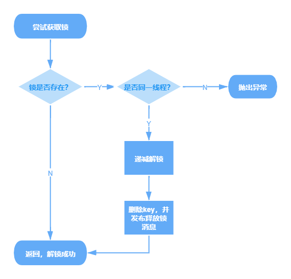

### C++
- C++ 中智能指针和指针的区别是什么？
- C++ 中多态是怎么实现的

### 网络
- 从输入 URL 到展现页面的全过程
- 简述 TCP 三次握手以及四次挥手的流程。为什么需要三次握手以及四次挥手
- HTTP 与 HTTPS 有哪些区别
- RestFul 是什么？RestFul 请求的 URL 有什么特点

### 数据库
- MySQL 为什么使用 B+ 树来作索引，对比 B 树它的优点和缺点是什么
- Redis 如何实现分布式锁
- 数据库的事务隔离级别有哪些？各有哪些优缺点

### 操作系统
- 进程和线程之间有什么区别


## 1.C++ 中智能指针和指针的区别

**补充 ：RAII 机制 Resource Acquisition Is Initialization**

在栈中的对象程序结束会自动调用析构函数

将初始化和资源释放都包装到类中：
- 保证了资源的正常释放（即使程序出现异常）
- 省去了异常处理冗长重复的步骤，确保了代码的异常安全
- 简化代码体积

### 1.1 智能指针
**智能指针** 智能指针定义在C++标准库中（STL），在<memory>头文件的std命名空间定义，智能指针的出现是为了确保程序没有内存和资源泄露。

- **unique_ptr**

**两种构造方法**


unique_ptr<type>p1(p2.release())
unique_ptr<type>p1(new type)

**使用：**
```c++
unique_ptr<Song> SongFactory(const std::wstring& artist, const std::wstring& title)
{
    // Implicit move operation into the variable that stores the result.
    return make_unique<Song>(artist, title);
}

void MakeSongs()
{
    // Create a new unique_ptr with a new object.
    auto song = make_unique<Song>(L"Mr. Children", L"Namonaki Uta");

    // Use the unique_ptr.
    vector<wstring> titles = { song->title };

    // Move raw pointer from one unique_ptr to another.
    unique_ptr<Song> song2 = std::move(song);

    // Obtain unique_ptr from function that returns by value.
    auto song3 = SongFactory(L"Michael Jackson", L"Beat It");
}
```

unique_ptr 的**基本特性**：它可以被移动，但不能被复制。 “移动”将所有权转移到新的 unique_ptr 并重置旧的 unique_ptr。

```c++
void SongVector()
{
    vector<unique_ptr<Song>> songs;
    
    // Create a few new unique_ptr<Song> instances
    // and add them to vector using implicit move semantics.
    songs.push_back(make_unique<Song>(L"B'z", L"Juice")); 
    songs.push_back(make_unique<Song>(L"Namie Amuro", L"Funky Town")); 
    songs.push_back(make_unique<Song>(L"Kome Kome Club", L"Kimi ga Iru Dake de")); 
    songs.push_back(make_unique<Song>(L"Ayumi Hamasaki", L"Poker Face"));

    // Pass by const reference when possible to avoid copying.
    for (const auto& song : songs)
    {
        wcout << L"Artist: " << song->artist << L"   Title: " << song->title << endl; 
    }    
}

```
**Notice**:在for循环中，遍历unique_ptr定义的类型需要用引用传递（const auto&），如果用值传递则会报出异常，因为unique_ptr不支持复制

**内置成员函数**
release 将会返回一个指针，调用者负责删除返回的指针，将unique_ptr设置为空的默认构造状态，可将另一个兼容类型的指针分配给unique_ptr
```c++
// stl_release_unique.cpp
// Compile by using: cl /W4 /EHsc stl_release_unique.cpp
#include <iostream>
#include <memory>

struct Sample {
   int content_;
   Sample(int content) : content_(content) {
      std::cout << "Constructing Sample(" << content_ << ")" << std::endl;
   }
   ~Sample() {
      std::cout << "Deleting Sample(" << content_ << ")" << std::endl;
   }
};

void ReleaseUniquePointer() {
   // Use make_unique function when possible.
   auto up1 = std::make_unique<Sample>(3);
   auto up2 = std::make_unique<Sample>(42);

   // Take over ownership from the unique_ptr up2 by using release
   auto ptr = up2.release();
   if (up2) {
      // This statement does not execute, because up2 is empty.
      std::cout << "up2 is not empty." << std::endl;
   }
   // We are now responsible for deletion of ptr.
   delete ptr;
   // up1 deletes its stored pointer when it goes out of scope.
}

int main() {
   ReleaseUniquePointer();
}

```

```
Constructing Sample(3)
Constructing Sample(42)
Deleting Sample(42)
Deleting Sample(3)
```
**reset**
取得指针所有权，删除原来的指针，重置为新指针。因为reset先存储新的指针ptr，然后删除原来存储的指针，所以reset有可能立即删除ptr，如果它和原来存储的指针一样的话。
|function    | paraphrase  |
|   -   |   -   |
|get|	Returns stored_ptr.|
|get_deleter|	Returns a reference to stored_deleter.|
|release|	stores pointer() in stored_ptr and returns its previous contents.|
|reset|	Releases the currently owned resource and accepts a new resource.|
|swap|	Exchanges resource and deleter with the provided unique_ptr.|


- **shared_ptr**

内置函数
|Member functions	|  |
| -|-|
|get	|获得资源的地址，如果未赋值的int指针，则初始化为0|
|owner_before|	如果a与b同为空或者同时指向同一个对象（包含继承关系），就返回false;如果是其它情况，则用指针所指向的对象的地址来比较大小，若a的地址<b的地址，则返回true，若a的地址>b的地址，则返回false|
|reset|	将资源重置|
|swap|	交换两个 shared_ptr 对象.|
|unique|测试是否为唯一资源所有者|
|use_count|	对资源所有者进行计数|

**构造shared_ptr**
```c++
#include<memory>
#include<iostream>

std::shared_ptr<int>sp0(new int(5));
std::shared_ptr<int>::element_type val = *sp0
```

多个智能指针可以共享同一个对象，对象的最末一个拥有着有责任销毁对象，并清理与该对象相关的所有资源。当某个资源被多个拥有者拥有，一个拥有者被清除并不会清除资源，直到最后一个拥有者离开其作用域或程序结束，资源被释放。


- **weak_ptr**

内置函数
|function   |   |
|-|-|
|expired|	Tests if ownership has expired.|
|lock|	Obtains exclusive ownership of a resource.|
|owner_before|	Returns true if this weak_ptr is ordered before (or less than) the provided pointer.|
|reset	|Releases owned resource.|
|swap|	Swaps two weak_ptr objects.|
|use_count|	Counts number of shared_ptr objects.|

- auto_ptr(不再使用，被unique_ptr取代)


**三种智能指针区别**

|   | unique_ptr  | shared_ptr  | weak_ptr  |
|-|-|-|-|
|赋值   | 特定对象只有一个指针可以拥有 | 利用计数跟踪指针的引用，发生赋值操作，计数+1，超出范围则-1  | 不控制对象生命周期的智能指针  |
|如何选择|不需要多个指向同一对象的指针|需要复制和赋值操作的指针|   |


### 1.2智能指针和普通指针

**智能指针和普通指针的声明**
```c++
void UseRawPointer()
{
    // Using a raw pointer -- not recommended.
    Song* pSong = new Song(L"Nothing on You", L"Bruno Mars"); 

    // Use pSong...

    // Don't forget to delete!
    delete pSong;   
}


void UseSmartPointer()
{
    // Declare a smart pointer on stack and pass it the raw pointer.
    unique_ptr<Song> song2(new Song(L"Nothing on You", L"Bruno Mars"));

    // Use song2...
    wstring s = song2->duration_;
    //...

} // song2 is deleted automatically here.
```

智能指针是声明在堆栈上的模板类，并使用指向堆分配对象的原始指针进行初始化。智能指针初始化后拥有原始指针，智能指针的析构函数包含对delete的调用，因为智能指针在堆栈上声明，当超出使用范围时会自动调用析构函数。

**智能指针用法和普通指针用法比较**

智能指针内部重载了-> 和 * 操作符，可以用符号来访问对象
智能指针有内部封装的方法，可以用点来调用


|    | 普通指针   | 智能指针  |
|-|-|-|
|如何构造|  用new开辟一块空间，需要用delete删除 | 用make_unique或构造时传入new 一个普通指针生成智能指针对象，不需要手动删除|
|声明|new分配在自由存储区|声明在堆栈|
|指针操作|可以用->指向对象的成员，用=进行赋值操作|重载了这些符号，可以普通指针的操作|
|实质|一个指针|一个对象|
|作用域|未delete的指针会一直占用内存空间，资源自动销毁|超出作用域会自动调用析构函数释放指针指向的资源|

## 2.C++中多态是如何实现的


## 3.从输入URL到展现页面的全过程

**简述步骤：**

- 1. 检查HSTS（HTTP Strict Transport Security）
- 2. DNS（Domain Name System）域名解析
- 3. 浏览器和服务器建立TCP连接（三次握手）
- 4. 浏览器发送HTTP请求
- 5. 服务器处理请求并返回资源（HTML，CSS，JS）
- 6. 浏览器解析渲染页面呈现给用户
- 7. 断开TCP连接


###3.1 HSTS HTTP Strict Transport Security

- 浏览器检查自带的预加载HSTS列表，列表中包含请求浏览器只使用HTTPS进行连接的网站
- 如果网站在这个列表中，浏览器会使用HTTPS协议而不是HTTP协议，否则，最初的请求会用HTTP协议发送

**补充HTTP协议和HTTPS协议区别**
1. HTTP协议以明文发送，数据未加密   HTTPS会先与客户端约定加密算法，传输过程加密
2. HTTP使用80端口，HTTPS使用443端口
3. HTTP使用三次握手建立连接，HTTPS除了TCP三次握手，要先建立SSL（Secure Socket Layer）连接

###3.2 DNS域名解析过程

- 1. **DHCP配置主机信息（Dynamic Host Configuration Protocol动态主机配置协议）.**本机IP不清楚的情况
- 2. **ARP (Address Resolution Protocol地址解析协议)解析网关MAC 地址**
- 3. **根据路由表中配置的网关路由器到达DNS服务器的路由表项向DNS服务器发送查询IP数据报，根据DNS的回答报文得到服务器IP地址**


- 1. 浏览器检查域名是否在缓存中
- 2. 如果缓存中没有，就去调用gethostbyname库函数进行查询，gethostbyname函数在检查域名是否在本地Hosts里，如果没有该域名的缓存记录，向DNS服务器发送DNS查询请求。
- 3. 对DNS服务器进行ARP查询，需要知道目标IP地址，需要知道发送ARP广播的接口MAC地址，获得目标IP地址


###3.3 建立TCP连接


- 客户端选择一个初始序列号（ISN）将设置了SYN=1,seq=x位的封包发送给服务器端，表明自己要建立连接
- 服务器收到客户端的连接请求报文，如果同意连接，则向A发送连接确认报文，SYN=1,ACK=1,确认号ack = x+1,同时也选择一个初始序号y
- 客户端收到服务器的连接确认报文后向B发出确认，确认号为y+1,序号为x+1
- 服务器收到客户端的确认，连接建立

###3.4 HTTP服务器请求处理

HTTPD(HTTP Daemon)在服务器端处理请求/响应。最常见的 HTTPD 有 Linux 上常用的 Apache 和 nginx，以及 Windows 上的 IIS。

- 1. 服务器把请求拆分为HTTP请求方法（GET,POST,HEAD,PUT,DELETE,CONNECT,OPTION）在地址栏直接输入使用GET方法；域名；请求路径，页面
- 2. 服务器验证主页接受GET方法
- 3. 服务器验证用户有权限使用GET方法
- 4. 部分服务器安装URL重写模块，服务器尝试匹配重写规则
- 5. 服务器处理解析并返回相应内容

###3.5 浏览器解析

当浏览器取回资源（HTML文件，图片或	其他内容）会解析并渲染然后呈现给用户

###3.6 断开TCP连接，四次挥手


- 客户端向服务器发送连接释放报文，FIN=1
- 服务器收到后发送确认，此时TCP之能单向通信
- 当服务器不需要连接时，发送连接释放报文，FIN=1
- 客户端收到后发出确认，进入TIME-WAIT状态，等待最大报文存活周期后关闭，服务器收到客户端ACK报文后关闭连接。


## 4. 简述 TCP 三次握手以及四次挥手的流程。为什么需要三次握手以及四次挥手


三次握手

- 三次握手指的是TCP连接的建立需要客户端和服务器端一共发送三个包
- 在三次握手之后，双方确认了对方已经准备好接收数据，确认了起始序列号和窗口大小
- 只有经过三次握手才能确保服务器和客户端的收发功能正常


四次挥手

- TCP连接的拆除，当一方想要关闭连接，就会向对方发送FIN标识，对方回复一个确认包，当对方准备好关闭连接时回回复一个FIN，接受方回复确认并等待一段时间关闭连接
- 确保连接不会有多余的FIN标识出现在下一个包


## 5.HTTP 与 HTTPS 有哪些区别


**区别**
|     | HTTP   |  HTTPS   |
|  -   |  -  |  -   |
| 安全性    |  协议以明文发送，数据都是未加密的，安全性较差  | HTTPS数据传输过程是加密的，安全性较好    |
|  连接方式   |  使用80端口  |  使用443端口   |
| 页面响应    | 较快，使用三次握手建立连接   |  除了TCP三次握手，要先建立SSL连接   |
|浏览器地址| http:// | https:// |
|是否需要SSL证书|不需要|需要|
|在计算机网络中哪一层|应用层|传输层|

- 浏览器地址栏中HTTP的URL是 http:// , 而HTTPS是https://
- HTTP安全性较差，明文传输，数据未加密，HTTPS（SSL+HTTP）数据传输过程是加密的，安全性较好。
- HTTP运行在应用层，HTTPS运行在传输层
- HTTP使用80端口发送数据，而HTTPS使用端口443
- HTTP不需要SSL证书，而HTTPS需要SSL证书并由CA（Certificate Authority,数字证书认证机构）签名
- HTTP页面响应速度比HTTPS快，因为HTTP使用TCP三次握手建立连接，客户端和服务器需要交换3个包建立连接，而HTTPS除了TCP的3个包，还需要SSL握手的9个包，一共需要客户端和服务器交换12个包。


### 5.1 HTTP 	

**HTTP**
- HTTP（Hyper Text Transfer Protocal)超文本传输协议，是一种简单的请求-响应协议，被用在WEB浏览器和网站服务器之间传递消息。客户机发起一个与服务器的TCP连接，一旦连接建立，浏览器和服务器进程就可以通过套接字访问TCP。客户机从套接字接口发送HTTP请求报文和接受HTTP响应报文，通信内容以明文发送，通信结束时连接关闭。


### 5.2 HTTPS的工作原理

HTTPS(Hyper Text Transfer Protocol Secure Socket Layer)是以安全为目标的HTTP协议，在HTTP的基础上通过传输加密和身份认证的方式保证了传输过程的安全性


- 1.客户端发起HTTPS请求，连接服务器的443端口，发送信息包括自身支持的算法和密钥长度。
- 2.服务器端配置
	服务器将自身支持的加密算法与客户端的列表对比并选择一种支持的加密算法，	将其和其他密钥组件一同发送给客户端。
- 3.传送证书
	服务器向客户端发送一个包含数字证书的报文，该数字证书中包含证书的颁发机	构，过期时间，服务端的公钥等信息。最后服务端发送一个报文通知客户端SSL的第一阶段已经协商完成
- 4.客户端解析证书
	SSL 第一次协商完成后，客户端发送一个回应报文，报文中包含一个客户端生成的随机密码串，称为 pre_master_secre，并且该报文是经过证书中的公钥加密过的。
- 5.客户端传送加密信息
	紧接着客户端会发送一个报文提示服务端在此之后的报文是采用pre_master_secre 加密的。
- 6.服务器端解密信息
- 7.服务器端传输加密后的信息
	服务端同样发送相同作用的报文，已让客户端进行确认，最后发送 finish 报文告诉客户端自己能够正确解密报文。
- 8.客户端解密信息

当服务端和客户端的 finish 报文交换完成之后，SSL 连接就算建立完成了，之后就进行和 HTTP 相同的通信过程，唯一不同的是在 HTTP 通信过程中并不是采用明文传输，而是采用对称加密的方式，其中对称密钥已经在 SSL 的建立过程中协商好了。


## 7.MySQL 为什么使用 B+ 树来作索引，对比 B 树它的优点和缺点是什么


**需求分析**
- 精确查询：根据具体的某个key来找到一条或者多条数据
- 范围查询：查询key在某一个范围内的数据
- 插入删除：尽量低的时间复杂度，同时部分数据库的数据存储在磁盘，需要尽量少的IO操作来提高速度

B+树查询一次只需要一次IO操作，且多叉树降低了树的高度，降低了遍历的层数且数据均存放在叶子节点中单次查询时间稳定，且B+树的叶子节点由双向链表相连更利于范围查找


### 7.1 B树和B+树

**B树**


- B树是一种多路平衡查找树
- 每个节点最多存储N个关键字，除了根节点和叶子节点，其他每个节点至少有M/2个孩子
- 若根节点不是叶子节点，则至少有两个孩子
- 所有叶子节点在同一层


**B+树**


- 非叶子节点只存储键值信息
- 数据检索规则为左开右闭
- 所有叶子节点之间有链指针
- 数据记录都放在叶子节点中


**B-tree和B+ Tree区别**
- 关键字的搜索，B树命中后就不会继续往下查找，因此每次找到关键字读取硬盘的次数不固定，B+树是左开右闭，所有结果均存在叶子节点中
- B+树根节点和枝节点没有数据，只有多路指针，数据保存在叶子节点中
- B+树叶子节点间存在链指针而B树没有


###7.3 MySQL为什么使用B+ 树来作索引

**磁盘预读**
MySQL通常将数据存放在磁盘中，读取数据就会产生磁盘IO消耗。而B+树的非叶子节点中不保存数据，B树非叶子节点会保存数据。B+树非叶子节点不用保存数据因此可以放更多的key，所以B+树高度比B树小，磁盘消耗更低

**全表遍历**
B+树叶子节点构成链表，更利于范围查找和排序，而B树范围查找需要遍历树。
且B+树查询次数一致，单次查询时间较稳定。

**为什么不用红黑树**
红黑树会使高度增高，增加IO消耗


## 8.Redis 如何实现分布式锁


###8.1分布式锁

现代操作系统大多为分布式系统，这就引入了分布式锁。目前实现分布式锁的三种方式：
- 1.使用数据库实现
- 2.使用Redis等缓存系统实现
- 3.使用Zookeeper等分布式协调系统实现

**如何设计一个分布式锁算法**

- 独享：任意时刻，只有一个客户端持有锁
- 无死锁：即使持有锁的客户端崩溃或者网络崩溃，锁仍然可以被获取
- 容错：只要大部分节点还活着，客户端就可以获取和释放锁

### 8.2 SETNX实现分布式锁


#### 8.2.1 单Redis实例实现分布式锁

**SET resource random_value NX PX 30000**

当resource不存在时才会成功执行（NX），有一个30s的自动失效时间（PX）,这个key的值为一个随机值，这个值在所有客户端必须是唯一的。


**释放锁**

```LUNA
if redis.call("get",KEY[1]) == ARGV[1] then
	return redis.call("del",KEYS[1])
else
	return 0
end
```


即使因为某些异常导致锁被错误的抢占，也能部分保证锁的正确释放。并且在释放锁时能检测到锁是否被错误抢占、错误释放，从而进行特殊处理

**随机值选取**
- 使用/dev/urandom作为RC4的种子和源产生一个伪随机流
- 一种更简单的方法是把以毫秒为单位的unix时间和客户端ID拼接起来

**需要注意超时时间和重试**
- 超时时间太短会导致任务完成前锁被释放，导致资源不受保护，超时时间太长会导致意外死锁后长时间等待。如果无法衡量超时时间，可以采用定期setex/expire更新超时时间
- 如果拿不到锁，建议根据任务性质，业务形式进行轮询等待


## 9. 数据库的事务隔离级别有哪些？各有哪些优缺点


### 9.1 什么是事务，事务有哪些特点

- 数据库事务指的是一组数据操作，事务内的操作要么全部成功，要么全部失败。比如网购付款的操作，用户付款后设计订单状态更新，扣库存等一系列动作，这就是一个事务。


事务的基本特点ACID atomicity, consistency, isolation, and durability.
A： 原子性 atomicity
C:  一致性 consistency
I: 隔离性 isolation
D: 持久性 durability

### 9.2 事务隔离的必要性

- 事务的隔离级别
	READ UNCONMMITTED    READ COMMITED   REPEATABLE READ  SERIALIZABLE
	读未提交，读已提交，可重复读，串行化
- 事务隔离级别需要解决的问题
	脏读：读到了其他事务未提交的数据未提交意味着数据有可能会回滚，可能不会存在在数据库中，也就是读到了不存在的数据
	
	
	幻读：针对INSERT操作，假设事务A对某些行内容做了更改，但是还未提交，此时事务B插入了与事务A更改前记录相同的记录行，并在A之前提交了，在事务A中查询，会发现好像刚刚的更改对于某些数据未起作用，其实是事务B刚插入进来的。
	
	
	可重复读：针对UPDATE，在一个事务中，最开始读到的和事务结束前任意时刻读到的同一批数据都是一致的
	
	
	不可重复读：同一事务内，不同的时刻读到的同一批数据可能是不一样的，可能会受到其他事务的影响，比如其他事务改了这批数据并提交了。每个 select 语句都有自己的一份快照，而不是一个事务一份，所以在不同的时刻，查询出来的数据可能是不一致的。
	

|隔离级别|脏读|不可重复读|幻读|
|-|-|-|-|
|读未提交|可能|可能|可能|
|读已提交|不可能|可能|可能|
|可重复读|不可能|不可能|可能|
|串行化|不可能|不可能|不可能|


- 如何设置

```
set global transaction isolation level read uncomitted  # 设置全局隔离级别为读未提交

```


### 9.3 MySQL中如何实现事务隔离

(1)读未提交：不加锁，无隔离效果
(2)读已提交：
(3)可重复读：为了实现可重复读，MySQL 采用了 MVVC (多版本并发控制) 的方式。

    当前事务内的更新，可以读到；
    版本未提交，不能读到；
    版本已提交，但是却在快照创建后提交的，不能读到；
    版本已提交，且是在快照创建前提交的，可以读到
(4)串行化：读的时候加共享锁，其他事务可以并发读取，但是不能写，写的时候加排他锁：其他事务不能读也不能写。

**并发写**

假设事务A执行 update 操作， update 的时候要对所修改的行加行锁，这个行锁会在提交之后才释放。而在事务A提交之前，事务B也想 update 这行数据，于是申请行锁，但是由于已经被事务A占有，事务B是申请不到的，此时，事务B就会一直处于等待状态，直到事务A提交，事务B才能继续执行

如果没有索引，MySQL 会为这张表中所有行加行锁，但是，在加上行锁后，MySQL 会进行一遍过滤，发现不满足的行就释放锁，最终只留下符合条件的行。一锁一释放的过程对性能也是影响极大。所以，如果是大表的话，建议合理设计索引。

**解决幻读**
行锁和间隙锁组合Next-Key锁

在事务A提交之前，事务B的插入操作只能等待，这就是间隙锁起得作用。当事务A执行update user set name='风筝2号’ where age = 10; 的时候，由于条件 where age = 10 ，数据库不仅在 age =10 的行上添加了行锁，而且在这条记录的两边，也就是(负无穷,10]、(10,30]这两个区间加了间隙锁，从而导致事务B插入操作无法完成，只能等待事务A提交。不仅插入 age = 10 的记录需要等待事务A提交，age<10、10<age<30 的记录页无法完成，而大于等于30的记录则不受影响，这足以解决幻读问题了。

这是有索引的情况，如果 age 不是索引列，那么数据库会为整个表加上间隙锁。所以，如果是没有索引的话，不管 age 是否大于等于30，都要等待事务A提交才可以成功插入。


总结：

- MySQL 的 InnoDB 引擎才支持事务，其中可重复读是默认的隔离级别。
- 读未提交和串行化基本上是不需要考虑的隔离级别，前者不加锁限制，后者相当于单线程执行，效率太差。
- 读提交解决了脏读问题，行锁解决了并发更新的问题。并且 MySQL 在可重复读级别解决了幻读问题，是通过行锁和间隙锁的组合 Next-Key 锁实现的。